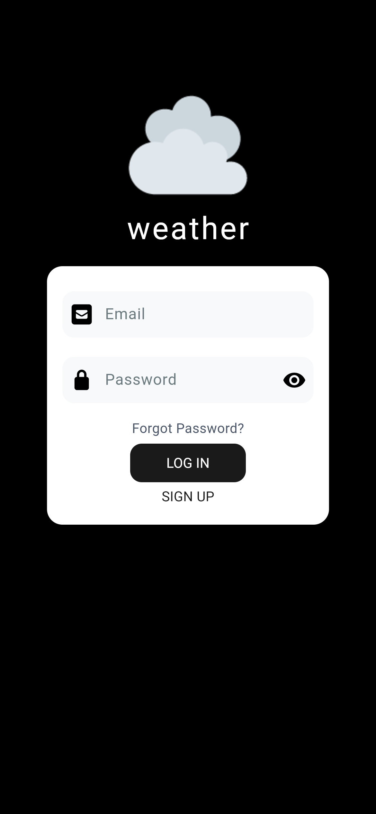
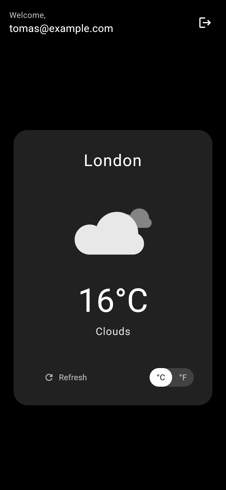

# Weather App

A Flutter web application that provides current weather information based on the user's location using the OpenWeatherMap API.

## Features

- **User Authentication**: Secure login system with email and password
- **Location-based Weather**: Automatically detects user location and displays current weather
- **Temperature Units**: Toggle between Celsius and Fahrenheit
- **Responsive Design**: Works on both desktop and mobile browsers

## Technology Stack

- **Frontend**: Flutter Web
- **Authentication**: In-memory user management with BCrypt password hashing
- **Weather Data**: [OpenWeatherMap Current Weather API](https://openweathermap.org/current)
- **Location**: Browser Geolocation API
- **State Management**: Provider pattern for auth, local state for weather data

## Screenshots

<p align="center">
  <table>
    <tr>
      <td></td>
      <td></td>
    </tr>
  </table>
</p>

## Setup

1. **Get an API key** from [OpenWeatherMap](https://openweathermap.org/api)

2. **Create a `.env` file** in the project root:

```bash
API_KEY=your_openweather_api_key
```

3. **Install dependencies**:

```bash
flutter pub get
```

4. **Run the app**:

```bash
flutter run -d chrome
```

## Test Accounts

For demonstration purposes, you can use these pre-configured accounts:

- `admin@example.com`/`admin`
- `tomas@example.com`/`dontdothisinprod`

## Security Notes

- Passwords are hashed using BCrypt before storage
- API key is kept in environment variables (though still visible in network requests as required by the OpenWeather API)
